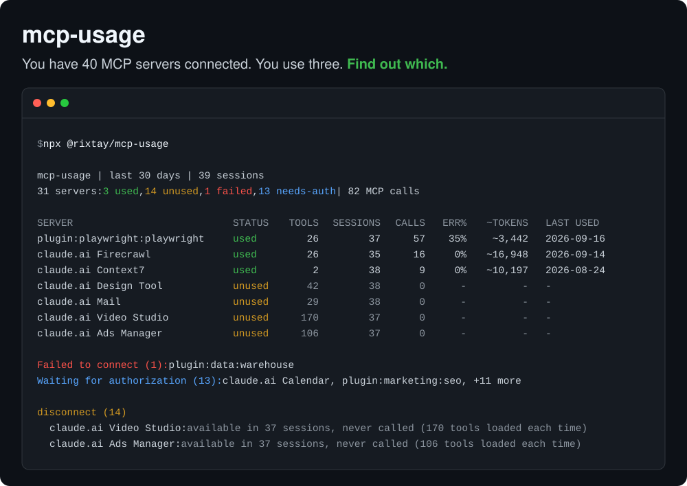
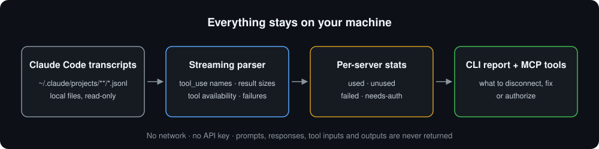

# mcp-usage



A small, focused [MCP](https://modelcontextprotocol.io) server and CLI that reads your **local Claude Code transcripts** and tells you, for every MCP server you have connected, whether it is actually **used**, sits **idle** in every session, **fails to connect**, or has been **waiting for authorization** for weeks — and what to disconnect.

Built for one job: answer *"which of my MCP servers should I keep?"* — locally, read-only, without ever exposing a word of your conversations.

## Tools

Four tools, all read-only:

| Tool | What it does |
|---|---|
| `usage_summary` | One row per server: status, tools exposed, sessions, calls, error rate, estimated result tokens, last use |
| `unused_servers` | **Servers that were connected but never called**, failed to connect, or are waiting for authorization |
| `server_details` | One server in full, with per-tool calls, errors and result size (accepts the id or the label, case-insensitive) |
| `recommendations` | A prioritized action list: disconnect, fix or remove, authorize or remove, investigate errors, heavy results |

Design choices:

- **Exact, not guessed.** Claude Code already records, in every session, which MCP tools were available and which servers failed or needed auth. "Available but never used" is a set difference over your own logs, not a heuristic.
- **Private by construction.** No network code at all. The output holds server names, tool names, counts, byte totals and timestamps — never prompts, responses, tool inputs, tool outputs, file paths or error messages. The test fixtures plant `SECRET_*` markers everywhere private content lives in a real transcript, and the tests assert none of them reach the library, the CLI or the MCP output.
- **Fast on big histories.** Transcripts are streamed line by line and lines that cannot matter are skipped before `JSON.parse`: ~360 MB of history (including a 90 MB session) scans in about 3 seconds.
- **Hygiene, not billing.** Cost analyzers (ccusage, agent-cost-mcp, …) tell you how many tokens and dollars you spent. This tells you which servers earn their place.
- Every tool ships a strict input schema and MCP annotations (`readOnlyHint`, `idempotentHint`) so hosts can auto-approve them.



## Requirements

- Node.js 22 or newer.
- [Claude Code](https://claude.com/claude-code) (CLI, desktop app or IDE extension) with some session history on this machine. Nothing else: no account, no API key, no configuration.

## 1. Run the report

No install needed, `npx` fetches the package from npm (`@rixtay/mcp-usage`, the installed command is `mcp-usage`):

```bash
npx -y @rixtay/mcp-usage
```

Or from a clone:

```bash
git clone https://github.com/Rixtayz/mcp-usage.git
cd mcp-usage
npm install && npm run build
node dist/bin/cli.js
```

| Option | Purpose |
|---|---|
| `--since <days>` | Look back this many days (default 30) |
| `--project <path>` | Only scan projects whose path contains this text |
| `--min-sessions <n>` | Sessions before an unused server is flagged (default 5) |
| `--dir <path>` | Claude config directory (default: `$CLAUDE_CONFIG_DIR` or `~/.claude`) |
| `--json` | Print the full report as JSON, including per-tool stats |

Text output truncates long lists; `--json` always contains everything.

## 2. Connect to Claude Code

```bash
claude mcp add --scope user --transport stdio mcp-usage -- npx -y @rixtay/mcp-usage serve
```

## 3. Connect to Claude Desktop / Cowork / any MCP client

Edit `~/Library/Application Support/Claude/claude_desktop_config.json` on macOS (or `%APPDATA%\Claude\claude_desktop_config.json` on Windows), reachable through **Settings → Developer → Edit Config**.

```json
{
  "mcpServers": {
    "mcp-usage": {
      "command": "npx",
      "args": ["-y", "@rixtay/mcp-usage", "serve"]
    }
  }
}
```

If the host cannot find `npx` (it may not inherit your shell `PATH`), use absolute paths instead: `"command": "/absolute/path/to/node"`, `"args": ["/absolute/path/to/mcp-usage/dist/bin/cli.js", "serve"]`.

The server reads Claude Code's transcripts wherever it runs, so it only makes sense in **local** sessions, on the machine where you use Claude Code.

## 4. Example prompts

- "Which of my MCP servers should I disconnect?"
- "Which servers have been waiting for authorization the longest?"
- "Playwright seems flaky. Which of its tools fail the most?"
- "Did I use anything other than Context7 in the last 7 days?"

Typical flow: `recommendations` → the assistant proposes a cleanup list, you confirm → `server_details` on anything surprising → you disconnect the servers yourself. The tools never touch your MCP configuration.

## What it reports

Each server gets one status:

| Status | Meaning |
|---|---|
| `used` | Called at least once in the window |
| `unused` | Its tools were available, but nothing ever called them |
| `failed` | Never exposed a tool; Claude Code reported a connection failure |
| `needs-auth` | Never exposed a tool; waiting for authorization |

Recommendations, in priority order:

| Action | Rule |
|---|---|
| `disconnect` | Unused, and available in ≥ 5 sessions (`--min-sessions`) |
| `fix-or-remove` | Failed to connect in ≥ 3 sessions |
| `authorize-or-remove` | Waiting for authorization in ≥ 3 sessions |
| `investigate-errors` | ≥ 5 calls and ≥ 30 % of them failed |
| `heavy-results` | Results average ≥ 10,000 estimated tokens per call |

## Development

```bash
npm test          # vitest: name parsing, streaming parser, aggregation, rules, CLI, MCP tools over an in-memory transport
npm run typecheck
npm run inspect   # MCP Inspector against the built server
```

Layout:

```
src/bin/cli.ts             entry point: `mcp-usage` prints the report, `mcp-usage serve` serves stdio
src/cli.ts                 argument parsing and output
src/server.ts              builds the McpServer and registers the four tools
src/analyze.ts             options → report; the one function both shells call
src/parser.ts              streaming JSONL reader → typed events
src/aggregate.ts           events → per-server stats
src/recommend.ts           stats → prioritized recommendations
src/report.ts              text table rendering
src/scan.ts                transcript discovery (--since, --project)
src/adapters/claude-code.ts  the only client-specific code, behind a small ClientAdapter interface
src/names.ts               `mcp__<server>__<tool>` parsing and server id mangling
```

Stack: `@modelcontextprotocol/sdk` v1, zod v4, nothing else at runtime. Design notes: [docs/DESIGN.md](docs/DESIGN.md).

## Things worth knowing

- **The transcript format is not a public API.** It is parsed defensively — every field optional, unknown records ignored, malformed lines counted and skipped — but a future Claude Code release can still break it. Tested against Claude Code 2.1.233 – 2.1.274.
- **Token figures are estimates**: result bytes ÷ 4, text only. Transcripts record no per-result token count, and image results are not counted.
- **Tool names are split on the first `__`** after the `mcp__` prefix. Server ids can contain underscores, hyphens, dots or be a bare UUID, and tool names can contain `__` themselves, so a naive `split("__")` miscounts.
- The same connector can appear under two names — a readable one in the CLI, a UUID in the desktop app. They are not merged.
- Servers bundled with the Claude desktop app (`ccd_*`) are reported but never flagged for disconnection: you cannot remove them.
- Claude Code deletes old transcripts, so a long `--since` window only sees what is still on disk.
- **Claude Code only**, for now. Adapters for other clients are welcome.

## License

MIT
